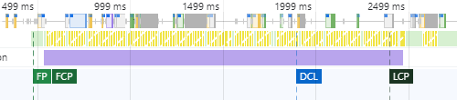

# Домашнее задание 4 часть 2

## Анализ страницы 
https://www.gd.ru/articles/9039-finansovyy-kontrol

## Network
Проанализировав результаты, показываемые профайлингом загрузки ресурсов, можно сказать, что в целом на сайте грузится очень большое количество различных файлов, от шрифтов то скриптов, которые составляют около 10 МБ, и грузятся очень медленно даже на быстом соединении.

[Логи панели Network](./Network/network_profile.har)

На слабом интернете и слабом устройстве такая загрузка занимает гораздо больше времени:

[Логи панели Network (slow 3G)](./Network/network_profile_slow3G.har)

### Неоптимальные места:
- Много дублирований ресурсов (Скрины в папке [screehshots](./Network/screenshots/))
- Большинство файлов с большим размером - файлы аналитики, рекламы и прочих ресурсов, оказывающие влияние на бытсроту загрузки сайта, но намеренно там использованы. Картинки же и прочие файлы принадлежащих сайту достаточно хорошо оптимизированы. (выделил одну крупную [гифку](./Network/screenshots/%D0%A1%D0%BA%D1%80%D0%B8%D0%BD%20(%D0%B1%D0%BE%D0%BB%D1%8C%D1%88%D0%BE%D0%B9%20%D1%80%D0%B0%D0%B7%D0%BC%D0%B5%D1%80%20%D1%84%D0%B0%D0%B9%D0%BB%D0%B0).png))
- Медленно загружающиеся ресурсы в основном файлы из раздела лишнего размера
- Блокируют рендеринг файлы высокого приоритета (загружается слишком много шрифтов и стилей), скрины также есть в папке
- Основные моменты описал выше, также присутсвуют файлы без содержимого (скрин в папке)

---

## Performance
Показатели произовительности на мощном устройстве средние

[Логи панели Performance](./Performance/performance.json)
- FP - примерно 500ms
- FCP - также примерно 500ms
- DCL - около 1900ms
- LCP - около 2400ms - рендер элемента боковой рекламы на заднем фоне

### С замедлением 

Логи панели Performance (4x CPU slowdown) - файл был слишком тяжелым :(
- FP - примерно 25s
- FCP - также примерно 25s
- DCL - около 55s
- LCP - около 1min - рендер красного блока в центре 
  

---

## Coverage
Результат тестирование покрытия 

- неиспользуемый js - около 2МБ
- неиспользуемый css - около 500КБ
